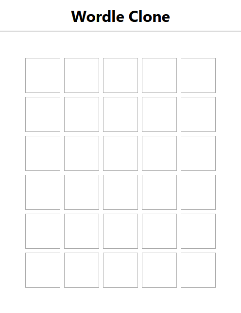
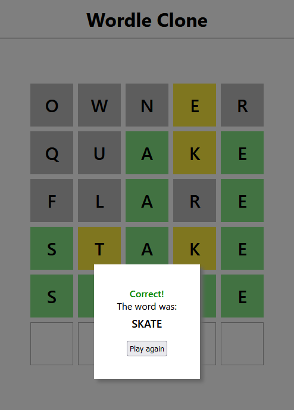

# Wordle Clone

This project is a clone of Wordle game owned and published by The New York Times Company.

I created this game using React.js

The app uses States, Hooks, a custom Hook (useWordle) and a Portal (for a pop-up).

The word to guess is picked randomly from words.json. I prepared this file myself by taking all five letter words without special characters from English dictionary and writing them into the file in uppercase. The difficulty level of my version of the game is significantly higher, because I did not filter the available words and there are 21952 of them in the file.

## How to play

The goal of the game is to guess randomly chosen, five letter long word. You have six tries to guess it.

Write the word you want to check using your keyboard and press enter after providing all five letters. Then some letters will be colorised in one of three colors below:

* Grey letter means that it is non-existent in the chosen word.
* Yellow letter means that the letter exists in the chosen word, but it is in incorrect position.
* Green letter means that the letter exists and it is in the correct position.

After six unsuccesful tries or after providing correct word a game over screen appears with result (Correct, Incorrect)

## How to run

After cloning the repo you need to:

* Run the app: npm start
* Run a json server for words.json: json-server --watch data/words.json

## Screenshots

